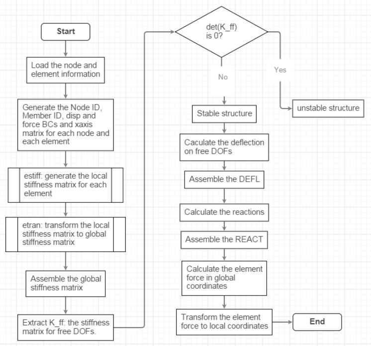
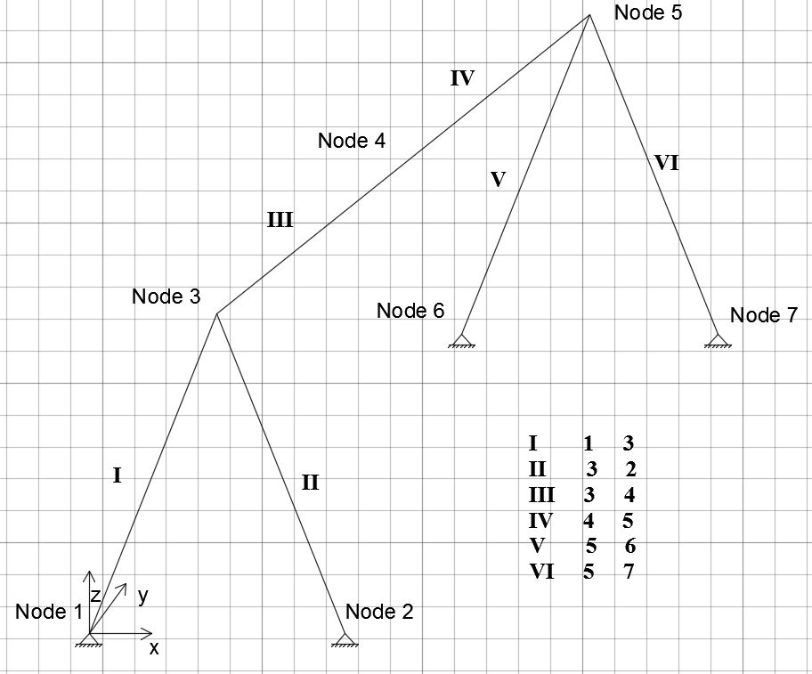

### Description
This is a Matlab implementation of 3D-finite-element-method for beams.
FEM calculates the bending moments, shear force and deflection accurately.
The code is verified with the analytical solution.

### Introduction

All codes are available inside the Code directory.

Folder 1:  Swing structural analysis.
        The code here is for the computation the swing structure without distributed load.

Folder 2:  Verification with a cantilever.
        The code here is the program with distributed load. The input are the verification example -- one simple cantilever. 

Folder 3:  Swing structural analysis with distributed load
        The code here is the program with distributed load. 

In each folder, just run "main", then, the result will show. 

Fore more information, see my final project report.

#### Flowchart

#### Swing Structure

